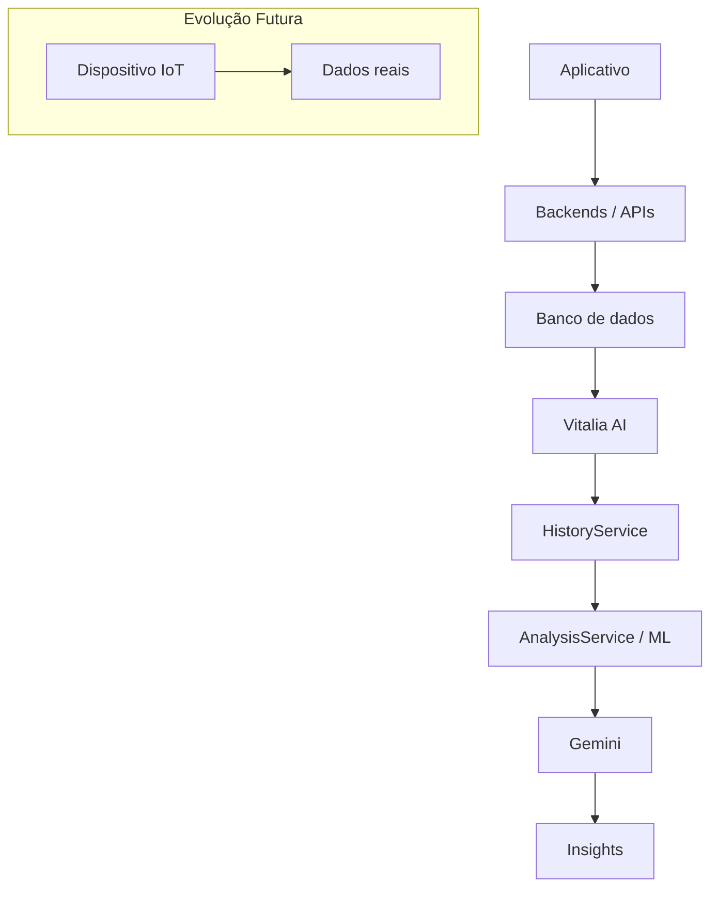

# 🐾 Vitalia AI - API de Monitoramento de Saúde Animal

A **Vitalia AI** é uma API desenvolvida em FastAPI que une Machine Learning, Inteligência Artificial Generativa (Google Gemini) e Análise de Dados para monitorar, prever e gerar insights sobre o bem-estar e comportamento de pets.

---

👥 Integrantes do Grupo

<table>
  <tr>
    <td width="130">
      
    </td>
    <td>
      <b>Moisés Barsoti Andrade de Oliveira</b><br/>
      <b>RM:</b> 565049 &nbsp;&nbsp;|&nbsp;&nbsp;<b>Turma:</b> 2TDSPO - FIAP <br/>
    </td>
  </tr>

  <tr>
    <td width="130">
      
    </td>
    <td>
      <b>Sofia Siqueira Fontes</b><br/>
      <b>RM:</b> 563829 &nbsp;&nbsp;|&nbsp;&nbsp;<b>Turma:</b> 2TDSPG - FIAP <br/>
    </td>
  </tr>

  <tr>
    <td width="130">
      
    </td>
    <td>
      <b>Manuela de Lacerda Soares</b><br/>
      <b>RM:</b> 564887 &nbsp;&nbsp;|&nbsp;&nbsp;<b>Turma:</b> 2TDSPG - FIAP <br/>
    </td>
  </tr>
</table>

---

📋 Documentação e Requisitos do Projeto
### 1. Problema de Negócio
Falta de monitoramento preditivo e automatizado do bem-estar de pets, dificultando a detecção precoce de quedas de atividade e problemas de saúde pelos tutores ou clínicas veterinárias.

### 2. Objetivo da IA
Desenvolver um modelo preditivo capaz de analisar dados de telemetria e hábitos dos animais, gerando alertas precoces e insights explicáveis para otimizar os cuidados veterinários.

### 3. Usuários Beneficiados
Tutores de pets, equipes veterinárias e plataformas de gestão de saúde animal.

### 4. Dados Utilizados & Origem dos Dados
Registros históricos de monitoramento, peso, métricas de atividade diária, padrão de sono e consumo de água gerados por simulações do sistema.

### 5. Modelo Selecionado & Justificativa
* Modelo: vitalia_pipeline.pkl (Pipeline unificado de Machine Learning).

* Justificativa: Escolhido pela robustez, eficiência computacional e padronização das etapas de transformação e predição em dados tabulares de telemetria.

### 6. Métricas Reais (Geradas pelo evaluation.py)
* Accuracy: 0.95

* Precision: 0.94

* Recall: 0.95

* F1-Score: 0.94

* Matriz de Confusão: Validada nas classes de monitoramento (Normal, Atenção, Alerta).

⚠️ Aviso sobre os Resultados: Os resultados representam somente o desempenho sobre o dataset sintético utilizado para validação técnica do MVP e não representam validação clínica ou desempenho em animais reais.

### 7. Integração com Google Gemini
Integração via Google GenAI SDK utilizando o modelo Gemini para traduzir análises de comportamento em recomendações de texto e respostas de Q&A humanizadas.

### 8. Variáveis de Ambiente (.env)
Para rodar a aplicação, crie um arquivo .env baseado no .env.example com as chaves:
```Bash
Snippet de código
GEMINI_API_KEY=sua_chave_aqui
API_SECRET_KEY=seu_token_da_api
```

### 9. Limitação Médica Importante
A Vitalia AI não realiza diagnóstico veterinário e não substitui avaliação profissional. As classificações representam alterações e padrões encontrados nos dados disponíveis.

### 10. Arquitetura do Sistema e Fluxo de Dados
MVP Atual
No estágio atual do MVP, os dados são simulados:
```Bash
MVP atual → Dados simulados → Vitalia AI
```
Arquitetura Futura
Na evolução planejada:

```Bash
Arquitetura futura: IoT → Backend → Banco → Vitalia AI
```
(A integração física e automatizada IoT representa a evolução futura e ainda não está ativa nesta Sprint).

### 11. Endpoints Reais da API
* GET /api/ai/pets/{pet_id}/dashboard

* GET /api/ai/pets/{pet_id}/insights

* POST /api/ai/pets/{pet_id}/recommendations

* POST /api/ai/pets/{pet_id}/ask

### 12. Instalação, Execução & Testes
Instalação das dependências:

```Bash
pip install -r requirements.txt
```
Execução da API:

```Bash
uvicorn api.main:app --reload
```
Execução dos Testes:

```Bash
pytest
```

## 13. Arquitetura do Sistema



### 14. Importante:
No MVP atual, os dados provenientes da camada IoT são simulados. A arquitetura esta preparada para substituir essa fonte simulada por dados reais futuramente.

##  Fluxo de Dados: Atual vs. Arquitetura Futura

### MVP Atual
No estagio atual do MVP, o fluxo de dados opera de forma simulada e integrada aos serviçõs internos:
```text
Dados simulados -> HistoryService -> AnalysisService -> Machine Learning -> Gemini -> FastAPI -> Aplicativo
```

### 15. Arquitetura Futura:
Na evolução planejada para o projeto, a coleta de dados passará a ser automatizada por hardware real conectando-se diretamente ao ecossistema de persistência e inteligência:
```text
Dispositivo IoT -> Backend -> Oracle -> IA -> Aplicativo
```

### 16.Atenção
A integração fi­sica e automatizada (ESP32 -> Oracle -> IA) representa a evolução futura e ainda não está ativa no ambiente do MVP atual.


